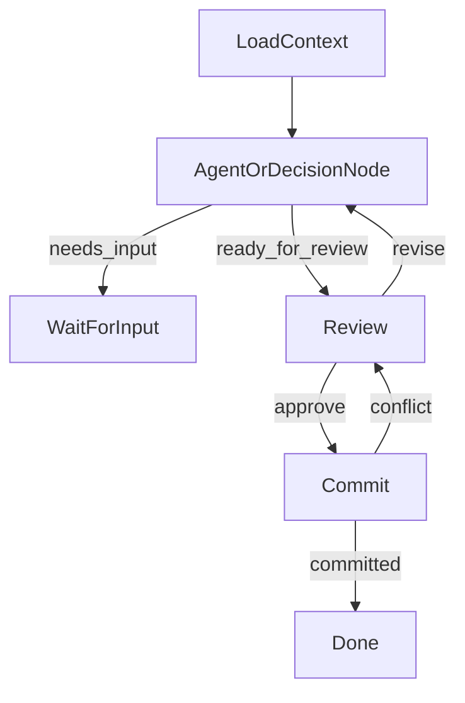
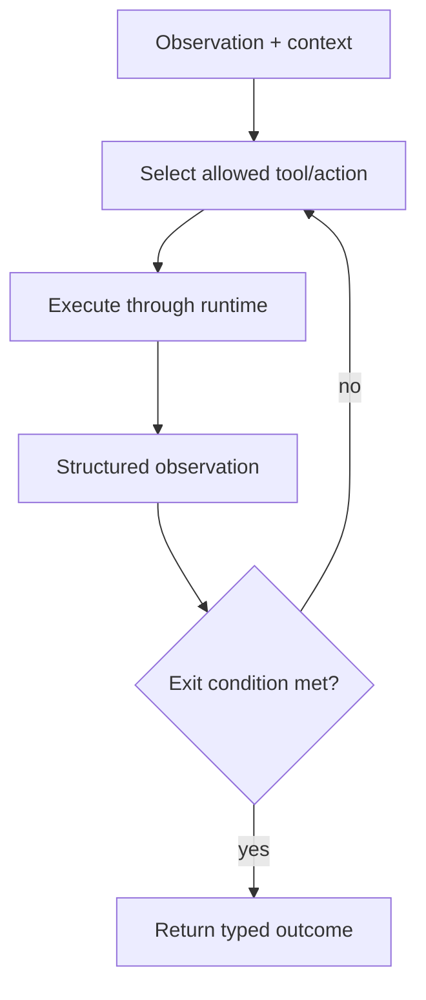

# Stateful Workflow and Hybrid Runtime

Read this reference only for a workflow or hybrid that persists state, waits for
an actor or external event, resumes after a delay, or performs a material action
through a resumable lifecycle.

## Stable execution scope

Persist an immutable `ExecutionScope` when the run starts. It contains the
values needed to interpret later transitions consistently:

| Field class | Examples |
|---|---|
| Actor and authorization | actor identity, grants, role, tenant or visibility scope |
| Target | object/reference scope and allowed target set |
| Interpretation basis | locale, timezone, calendar, policy version when relevant |
| Concurrency | input/object versions and correlation/idempotency references |
| Runtime compatibility | workflow and checkpoint schema versions |

Prompts, transcripts, and scratchpads are not substitutes for this scope. A
resume reads it; it must not recompute changing values such as current time,
date, target selection, or permissions.

## Lifecycle and resume

Define a finite state model with ownership, allowed transitions, timeout,
cancellation, and terminal states. Before every resume, perform deterministic
preflight checks for:

1. checkpoint existence and ownership;
2. workflow/checkpoint schema compatibility;
3. execution-scope and authorization consistency;
4. input, target, and concurrency-version validity; and
5. the expected waiting state and action binding.

Do not enter the graph/runtime if preflight fails. Return a defined conflict or
recovery outcome instead. Specify whether a waiting run may cross a time or
policy boundary, and whether it must expire, migrate, or restart.

## Workflow diagram and node table

Include a top-level workflow diagram for any stateful workflow or hybrid. The
diagram should show only durable stages, waiting points, terminal states, and
allowed transitions. Do not mix in every internal validation branch, database
write, version check, or tool call as if it were a workflow state. Put internal
agent/tool loops in a separate diagram when they materially affect behavior.

Use a stable notation such as Mermaid:

For hybrid designs, explicitly show which node contains the bounded agent loop,
then add a second small diagram for that loop:

The diagram is not the contract. Follow it with a node table that identifies
authority, AI involvement, exit conditions, and allowed tools/calls. Use this
table as the runtime permission boundary:

| Workflow node | AI-driven? | Loop / wait type | Satisfying exit condition | Allowed tools/calls | Must not do |
|---|---|---|---|---|---|
| `LoadContext` | no | deterministic step | authoritative context and scope loaded, or typed technical failure | read-only queries | infer missing facts from transcript |
| `AgentOrDecisionNode` | yes/no | bounded loop or single model call | typed outcome such as `changed`, `needs_input`, `no_op`, `rejected`, `tool_error`, or `budget_exhausted` | stage-scoped tools only | create trusted IDs/facts or bypass validation |
| `WaitForInput` | no | actor wait state | valid response, cancellation, expiry, or new input routed to the right node | slot/capability validation, read-only context | silently treat ambiguous input as approval |
| `Review` | no unless explicitly justified | actor wait state | revise, approve, cancel, expire, or conflict refresh | render/read-only calls and validation | perform material writes or infer approval |
| `Commit` | no | deterministic transaction | committed, stale/conflict, rejected, unknown-timeout, or retryable failure | one governed use case / side-effect call | re-run semantic interpretation or broaden scope |
| `Done` | no | terminal state | committed result returned idempotently | authoritative read of result | mutate closed workflow state |

For each row, define all possible outcomes, not just the happy path. If a node
is AI-driven, define the deterministic runtime validator and budgets in the
design, and also apply the bounded-loop reference. If a node is not AI-driven,
the model may not decide its transition or material result; at most it may
produce copy that is derived from already-validated facts.

Keep the table generic and operational. Prefer tool categories such as
`Query:*`, `Command:*`, `Renderer:*`, and `UseCase:*` when a project uses mixed
tool types. A command or use case that performs durable writes should normally
appear only in the node that owns that write.

## Approval and resumable actions

Use an issued capability for a material action. In addition to the general
actor, operation, target/version, expiry, and idempotency bindings, a resumable
capability binds `run_id`, checkpoint reference, workflow-state version, and
the expected wait state. Record issuance, consumption, expiry, and replay
behavior. Revalidate domain preconditions immediately before the side effect.

## Failure and caller recovery

For each transition define the transport result, runtime state, safe visible
message, retryability, and caller recovery action. Distinguish at least:

| Outcome | Typical caller action |
|---|---|
| conflict or stale capability | discard local action and refresh authoritative state |
| missing/incompatible checkpoint | restart or regenerate the review; do not resume blindly |
| retryable execution failure | offer a bounded explicit retry |
| non-retryable failure | close/escalate or require a new run |
| confirmed side effect | return the authoritative committed result, idempotently |

Never encode a failed transition as a successful transport response with no
actionable outcome.

## Workflow review additions

- [ ] ExecutionScope has an authority, schema version, lifecycle, and allowed writers.
- [ ] State transitions, waits, cancellation, expiry, and terminal states are explicit.
- [ ] Resume preflight prevents entering an absent, incompatible, stale, or wrong wait state.
- [ ] Resumable capabilities bind the run/checkpoint/state and have consumption/replay semantics.
- [ ] Tests cover stale/replayed actions, concurrent state change, missing/incompatible checkpoints, cancellation, timeout, and relevant time/locale boundaries.
